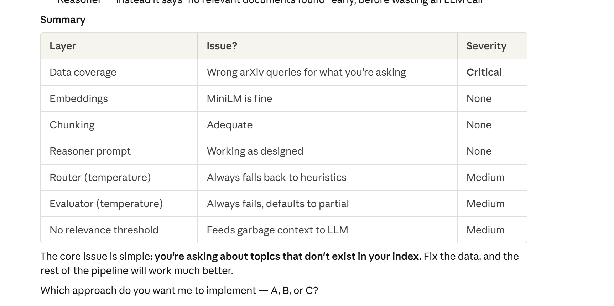
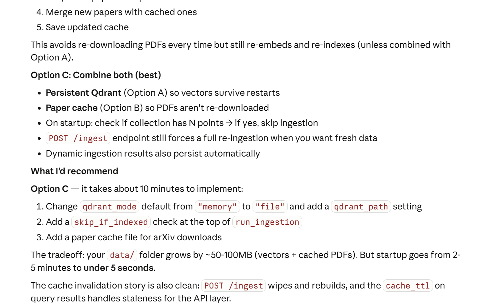
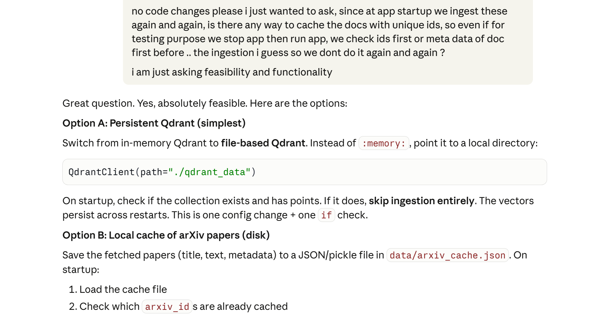

# Science GPT

Multi-agent RAG over scientific data. Ask it anything — it routes the query, retrieves from two sources, reasons over the results, and checks its own answer.

---

## How it works

```
Query
  │
  ▼
Router ──► Retriever(s) ──► Reasoner ──► Evaluator ──► Response
            │        │
          Qdrant   WHO CSV
         (arXiv)  (Pandas)
```

**Router** — classifies query as `text`, `structured`, or `hybrid` using LLM + keyword heuristics. Falls back to heuristic if LLM is slow.

**Retriever** — runs in parallel:
- *Vector*: embeds query with `all-MiniLM-L6-v2`, hits Qdrant for top-k arXiv chunks
- *Structured*: parses filters/aggregations from the query, runs them on WHO CSV via Pandas

**Dynamic ingestion** — if vector scores fall below threshold, fetches new arXiv papers on the fly and retries. No manual re-ingestion.

**Entity linker** — when a query spans both sources (e.g. "AI in healthcare + life expectancy in Japan"), enriches vector results with matching WHO rows.

**Reasoner** — LangChain Deep Agent builds the final answer using retrieved context + tools. Falls back to direct OpenAI call if Deep Agent is unavailable.

**Evaluator** — LLM-as-judge. Checks every claim against source material. Fails the answer and returns a safe fallback if it doesn't hold up.

---

## What's built

**Core**
- Two sources: arXiv (papers → chunks → Qdrant) and WHO health stats (CSV → Pandas)
- Router with LLM + heuristic fallback
- Parallel vector + structured retrieval
- Reasoner with 3 tools: calculator, summariser, sandboxed Python executor
- `POST /query` returns answer, sources, evaluation verdict, per-stage latency

**Scalability**
- Fully async — concurrent requests don't block each other
- Per-request `trace_id` via `contextvars` for clean isolated logs
- TTL query cache (10 min default), auto-invalidated on `POST /ingest`
- File-based Qdrant — vectors survive restarts, no Docker needed
- Paper cache (`data/arxiv_cache.json`) — arXiv papers persist across restarts, no re-download
- Dynamic ingestion — fetches on demand, persists to cache

**Robustness**
- Evaluator rejects hallucinated answers and returns a fallback
- `POST /evaluate` runs a benchmark: routing accuracy, support rate, refusal rate, p95 latency
- Code executor: AST-based static analysis blocks dangerous imports before running anything

---

## Setup

**Requirements:** Python 3.11+, OpenAI API key

```bash
git clone <repo-url> && cd science_gpt
python -m venv .venv
source .venv/bin/activate        # Windows: .venv\Scripts\activate
pip install -r requirements.txt
cp .env.example .env             # add your OPENAI_API_KEY
python run.py
```

First run: downloads the embedding model (~80MB), fetches ~40 papers from arXiv, chunks and indexes them. Takes 1–3 min.

After that: Qdrant and paper cache are on disk — restarts are instant.

**Docker:**
```bash
docker compose up --build
```

---

## Config

All settings in `.env`. Key ones:

| Variable | Default | What it does |
|---|---|---|
| `OPENAI_API_KEY` | required | Your OpenAI key |
| `LLM_MODEL` | `gpt-5-mini` | Model for routing, reasoning, evaluation |
| `QDRANT_MODE` | `file` | `memory`, `file`, `docker`, or `cloud` |
| `QDRANT_PATH` | `./qdrant_data` | Where vectors live on disk |
| `RETRIEVAL_TOP_K` | `5` | Results per retriever |
| `CHUNK_SIZE` | `800` | Characters per chunk |
| `CACHE_TTL_SECONDS` | `600` | Query cache TTL |
| `ARXIV_MAX_PAPERS` | `8` | Papers fetched per topic at startup |
| `DYNAMIC_INGESTION_ENABLED` | `true` | Fetch new papers when relevance is low |
| `DYNAMIC_INGESTION_SCORE_THRESHOLD` | `0.45` | Score that triggers dynamic fetch |

See `.env.example` for the full list.

---

## API

**`POST /query`**
```json
{ "query": "What is the life expectancy in Japan and how does AI help healthcare?" }
```
Returns:
```json
{
  "answer": "...",
  "query_type": "hybrid",
  "sources": [{ "source": "arXiv:...", "relevance_score": 0.87, "text_snippet": "..." }],
  "evaluation": { "verdict": "supported", "confidence": 0.95, "issues": [] },
  "latency": {
    "routing_ms": 420,
    "retrieval_ms": 130,
    "dynamic_ingestion_ms": 0,
    "reasoning_ms": 2100,
    "evaluation_ms": 780,
    "total_ms": 3430
  },
  "cached": false
}
```

**`POST /ingest?force=false`** — re-run ingestion, invalidate cache. `force=true` wipes and rebuilds Qdrant from scratch.

**`POST /cache/invalidate?query=...`** — bust one query or the whole cache.

**`POST /evaluate`** — run the benchmark. Returns routing accuracy, support/partial/refusal rates, avg latency.

**`GET /health`** — liveness check.

**`GET /stats`** — vector count, cache size, ingestion stats.

---

## Architectural decisions

**Explicit orchestration, not chains**

Each stage (route → retrieve → reason → evaluate) is a plain async call. Nothing hidden in a black-box chain. Logs show exactly what happened at each step. LangChain Deep Agent is only used for reasoning, where its planning actually adds value.

**File-based Qdrant**

In-memory Qdrant is gone on restart — you'd re-fetch and re-embed every time. File mode gives the same API with persistence. No Docker needed. Switch to Docker or cloud with one env var (`QDRANT_MODE=docker`).

**Two-layer caching**

Paper cache (disk) — arXiv PDFs aren't downloaded twice. Query cache (memory, TTL) — repeated queries skip the LLM. Both layers are independent, both have invalidation paths.

**Dynamic ingestion**

Static startup ingestion can't cover every topic. When average retrieval score is below threshold, the pipeline fetches papers for that query, indexes them, and retries — all in the same request. New papers persist to disk for next time.

**LLM-as-judge**

A second LLM call checks the answer against sources. Adds ~800ms. For scientific QA where correctness matters, it's worth it.

---

## LLM conversation

Debugged with claude. Two parts worth mentioning:

### Why the pipeline kept refusing to answer
**My question:**
> it kind of mentions at last "if you want more detail I can't provide that" — which is a concern. Did it not get the data? Are we fetching too little information? Is it an embedding/similarity mismatch? Or is the article just not present? Or is it a prompting issue? Trying to understand the reasons first. Don't do any code changes — I want to think through this first.

Traced through 6 layers to find the root cause: topic coverage gap → embedding quality → chunk size → prompt wording → evaluator strictness → fallback logic. Each layer looked fine in isolation; the issue only appeared when they combined.



---

### Dynamic ingestion design

Three options were on the table: pre-fetch extra topics at startup, background async fetch, or inline on-demand fetch. Went with inline because it's the simplest path that actually solves the problem — no background jobs, no state to manage, works within the existing request.




---

## What I'd do differently with more time

**Cross-encoder reranker** — `all-MiniLM-L6-v2` is fast but weak at ranking. A cross-encoder like `ms-marco-MiniLM-L-6-v2` as a second pass would improve precision.

**Learned router** — current LLM+heuristic router works but costs a full LLM call per query. A small fine-tuned classifier would be faster and more consistent.

**Full PDF ingestion** — using abstracts only right now. Section-aware chunking with `pymupdf4llm` would give much richer context.

**Redis cache** — in-memory query cache is lost on restart. Redis would persist it across restarts and instances.

**Streaming** — `StreamingResponse` + LangGraph streaming to show reasoning steps live.

---

## Known limitations

- arXiv rate limits can slow large ingestion runs
- `all-MiniLM-L6-v2` degrades on long or highly technical queries
- No auth on the API — add middleware before exposing publicly
- Dynamic ingestion adds latency on first query for a new topic
- `gpt-5-mini` doesn't support `temperature=0` — all calls use `temperature=1`
